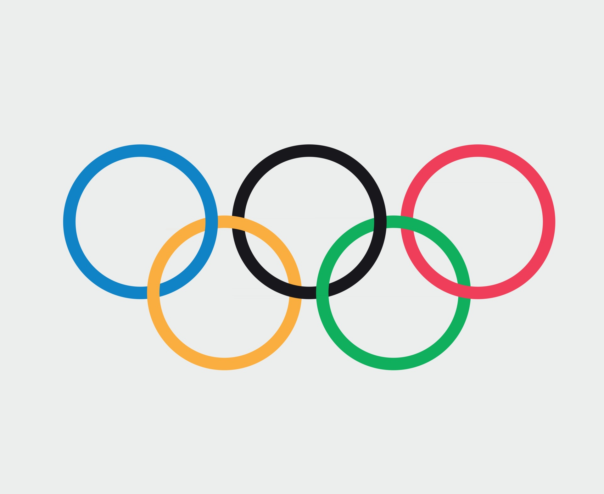

# Analyzing Olympic Data: An Introduction

## Introduction

The Olympic Games are a global sporting event that bring together athletes from around the world to compete in a variety of sports. The rich history and data associated with the Olympics provide a valuable resource for analysis and insights into trends, performance, and participation over the years. In this notebook, we will explore the Olympic dataset to uncover interesting patterns and statistics.

## Dataset Description

The dataset used in this analysis comprises two primary tables:

1. **`olympics`**: This table contains detailed information about individual athletes and their participation in the Olympic Games, including the events they competed in, their performance (medals won), and other related details.
2. **`noc`**: This table includes information about the National Olympic Committees (NOCs), which represent the countries and regions participating in the Olympics.

### Key Columns in the `olympics` Table:
- **`name`**: The name of the athlete.
- **`sex`**: The gender of the athlete.
- **`age`**: The age of the athlete at the time of competition.
- **`team`**: The name of the team or country the athlete represents.
- **`noc`**: The National Olympic Committee code.
- **`games`**: The year and season of the Olympics.
- **`sport`**: The sport in which the athlete competed.
- **`event`**: The specific event within the sport.
- **`medal`**: The type of medal won (Gold, Silver, Bronze).

### Key Columns in the `noc` Table:
- **`noc`**: The National Olympic Committee code.
- **`region`**: The name of the country or region.
- **`notes`**: Additional notes or historical context about the NOC.

## Data Cleaning Process

Before conducting any analysis, it is essential to clean and preprocess the data to ensure accuracy and consistency. The following steps were taken to clean the Olympic dataset:

1. **Importing Data**: The `olympics` and `noc` tables were imported into the Jupyter Notebook environment.
2. **Handling Missing Values**: Missing values in critical columns such as `medal` and `age` were addressed. Rows with missing `medal` values were retained as they represent athletes who participated but did not win medals. Missing `age` values were handled by removing those rows or imputing reasonable values based on the dataset's context.
3. **Data Type Conversion**: Ensured that columns have appropriate data types. For instance, `age` should be an integer, and `medal` should be a categorical variable.
4. **Removing Duplicates**: Checked for and removed any duplicate rows to maintain data integrity.
5. **Merging Tables**: Joined the `olympics` and `noc` tables on the `noc` column to enrich the athlete data with country/region information.
6. **Creating New Columns**: Derived new columns where necessary, such as calculating the medal efficiency ratio or categorizing athletes based on age groups.

## Answering Business Questions

In addition to data cleaning, this notebook includes analysis and answers to several business questions. These questions cover various aspects such as:

- Medal efficiency ratio (medals won per athlete) for each country.
- Total number of nations that participated in each Olympic game.
- Sports that were played only once in the Olympics.
- Advanced queries to derive insightful statistics from the dataset.

With the data cleaned and prepared, we can now proceed with various analyses to gain insights into Olympic participation, performance trends, and more.
